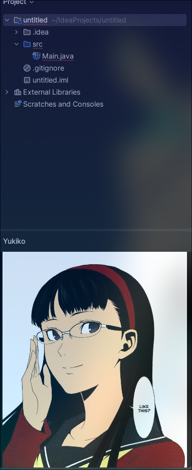

  

   <B> Bored coders will do anything but coding something useful </B>

   IntelliJ Plugin that displays a window of Yukiko Amagi in your workspace

   <B> HOW TO INSTALL </B>

   1 - Download the zip file or clone this repo
    
   2 - Open IntelliJ - > Settings - > Plugins - > Install plugin from devide
    
   3 - Pick .zip file called <b> Yukiko-1.0.0-SNAPSHOT.zip </b> and restart your ide
    
   4 - Open a project - > View - > Tool Windows - > Yukiko
   

 
